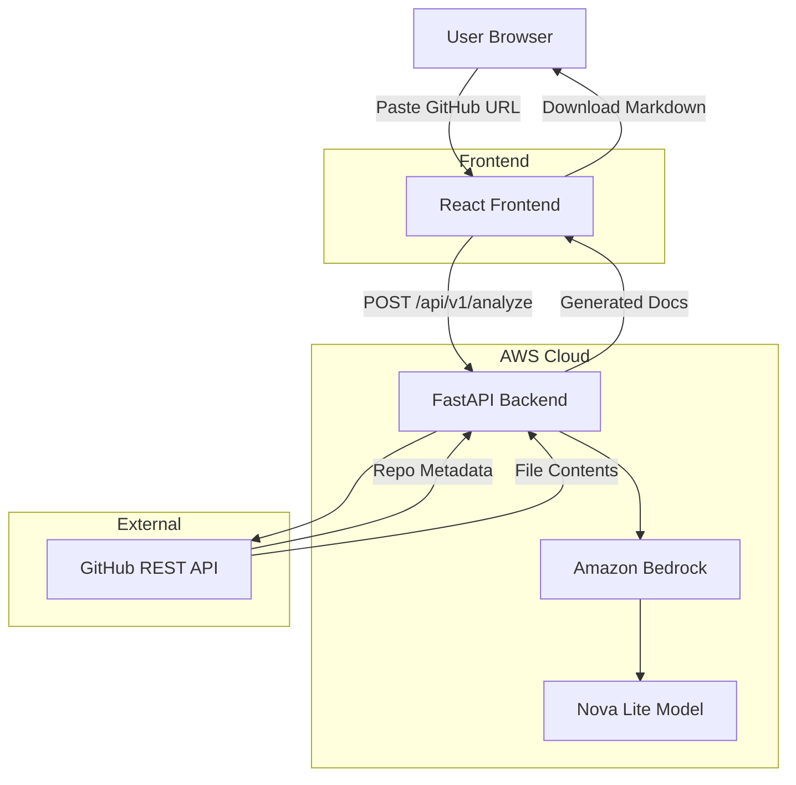

# RepoDoc AI

AI-powered GitHub Documentation Assistant that automatically analyzes GitHub repositories and generates professional documentation using Amazon Bedrock.

## Architecture

## AWS Architecture

### Frontend: AWS Amplify
- React SPA hosted on AWS Amplify
- Global CDN via CloudFront
- Automatic SSL and custom domain support
- CI/CD from GitHub

### Backend: AWS EC2 (Amazon Linux 2023)
- FastAPI application running on EC2 with Amazon Linux 2023
- Uvicorn ASGI server (2 workers) managed by systemd
- Nginx reverse proxy for HTTP/HTTPS traffic
- Auto-restart on failure and boot

### AI: Amazon Bedrock
- Nova Lite model for text generation
- Serverless, no model hosting management
- Pay-per-token pricing
- Built-in safety and content filtering
- Authentication via EC2 IAM role (no access keys)

### Data Flow
1. User submits GitHub URL on the frontend
2. Frontend sends request to EC2 instance (port 80 → Nginx → 8000)
3. Nginx proxies request to Uvicorn/FastAPI
4. Backend invokes GitHub REST API to fetch repository data
5. Backend analyzes repository structure and dependencies
6. Backend sends analysis to Amazon Bedrock (Nova Lite)
7. Bedrock generates documentation content
8. Response returned through Nginx to frontend
9. Frontend displays results with preview and download options