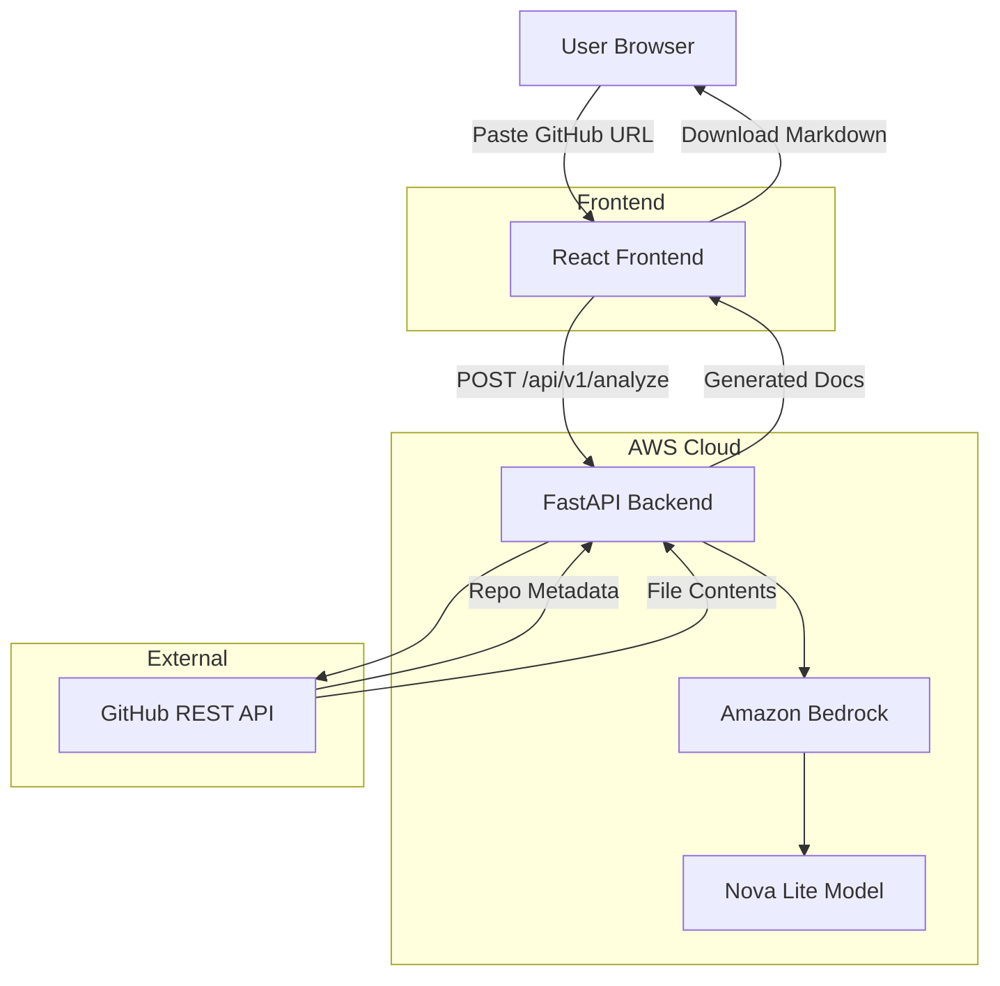

# RepoDoc AI

AI-powered GitHub Documentation Assistant that automatically analyzes GitHub repositories and generates professional documentation using Amazon Bedrock.

## Architecture

## AWS Architecture

### Frontend: AWS Amplify
- React SPA hosted on AWS Amplify
- Global CDN via CloudFront
- Automatic SSL and custom domain support
- CI/CD from GitHub

### Backend: AWS App Runner
- FastAPI application containerized with Docker
- AWS App Runner for managed container hosting
- Auto-scaling, built-in load balancing
- SSL/TLS termination

### AI: Amazon Bedrock
- Nova Lite model for text generation
- Serverless, no model hosting management
- Pay-per-token pricing
- Built-in safety and content filtering

### Data Flow
1. User submits GitHub URL on the frontend
2. Frontend sends request to App Runner service URL
3. App Runner invokes GitHub REST API to fetch repository data
4. Backend analyzes repository structure and dependencies
5. Backend sends analysis to Amazon Bedrock (Nova Lite)
6. Bedrock generates documentation content
7. Response returned to frontend
8. Frontend displays results with preview and download options